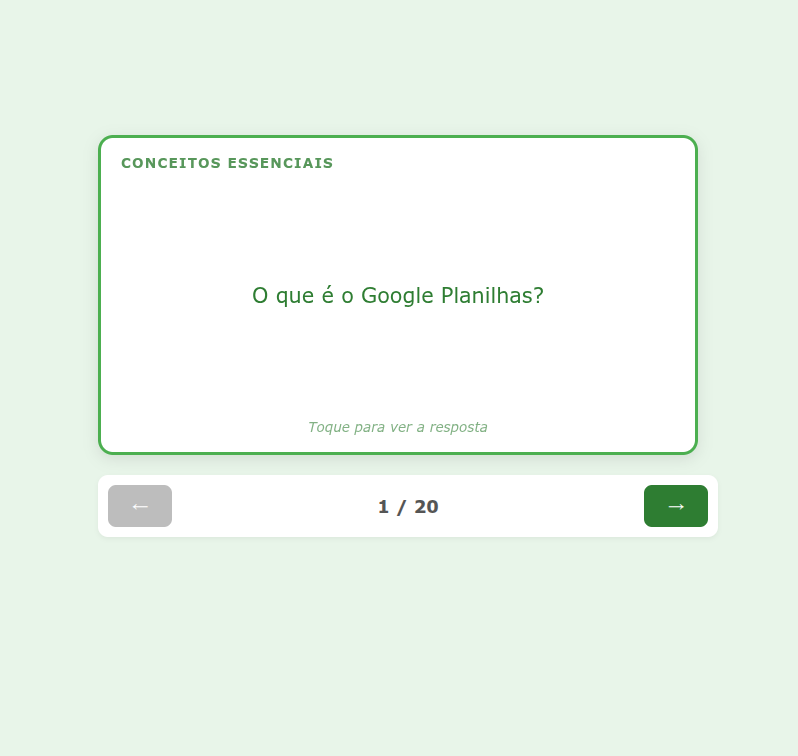

# 📊 Flashcards Interativos: Google Planilhas



> Uma ferramenta de estudo interativa, leve e gamificada para auxiliar no ensino e aprendizado das funções essenciais do Google Planilhas.

---

## 🖼️ Preview

_Interface limpa, responsiva e com animações fluídas de "flip" para revelar as respostas._

---

## 📖 Sobre o Projeto

Este projeto consiste em uma aplicação web de **Flashcards (Cartões de Estudo)** desenvolvida para reforçar conceitos do Google Planilhas. O objetivo é oferecer uma maneira dinâmica de revisar conteúdos como:

- 🔹 Conceitos e Estrutura básica.
- 🔹 Formatação e Configurações.
- 🔹 Fórmulas essenciais (SOMA, MÉDIA, CONT.SE).
- 🔹 Visualização de dados (Gráficos).

O projeto é **Self-Contained** (contido em um único arquivo), o que facilita o compartilhamento via e-mail, WhatsApp ou Google Classroom sem necessidade de instalação complexa.

---

## 🚀 Funcionalidades

- **Interatividade:** Clique para virar o cartão (efeito 3D Flip).
- **Navegação:** Botões intuitivos para avançar e retroceder entre os tópicos.
- **Categorização:** Os cartões são divididos visualmente por blocos de conteúdo.
- **Contador de Progresso:** Indica em qual cartão o aluno está.
- **Design Responsivo:** Funciona perfeitamente em Desktops, Tablets e Celulares.
- **Zero Dependências:** Feito com HTML, CSS e JavaScript puro (Vanilla).

---

## 🛠️ Como Usar

### Para Alunos
1. Baixe o arquivo `flashcards_aula.html`.
2. Abra o arquivo em qualquer navegador (Chrome, Edge, Firefox, Safari).
3. Comece a estudar!

### Para Professores/Desenvolvedores
Se você deseja clonar e modificar o projeto:

```bash
# Clone este repositório
$ git clone [https://github.com/SEU-USUARIO/nome-do-repo.git](https://github.com/SEU-USUARIO/nome-do-repo.git)

# Acesse a pasta do projeto
$ cd nome-do-repo

# Abra o arquivo index.html no seu navegador
